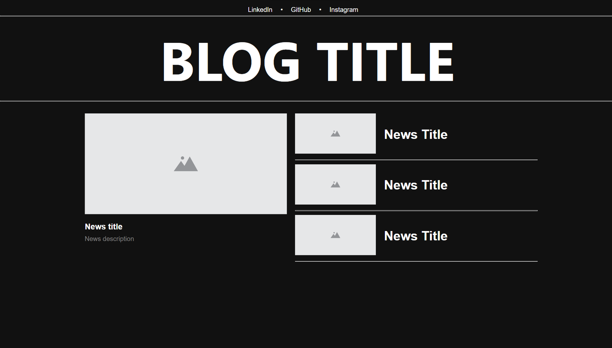

<h1 align="center"> Blog Angular </h1>

Projeto desenvolvido durante o bootcamp da Dio NTT Data Diversidade em Tech

  <a href="#-tecnologias">Tecnologias</a>&nbsp;&nbsp;&nbsp;|&nbsp;&nbsp;&nbsp;
  <a href="#-projeto">Projeto</a>&nbsp;&nbsp;&nbsp;|&nbsp;&nbsp;&nbsp;
  <a href="#-layout">Layout</a>&nbsp;&nbsp;&nbsp;

 

  

## 🚀 Tecnologias

Esse projeto foi desenvolvido com as seguintes tecnologias:

- HTML
- CSS
- JavaScript
- TypeScript
- Angular
- Git e GitHub

## 💻 Projeto

O projeto foi o desenvolvimento de um blog utilizando o Angular para criar os seus componentes

---
